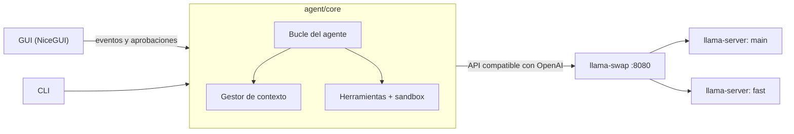

# Agente local

Un agente de programación que corre **100 % en tu PC**: lee, busca, edita y ejecuta código en tu
proyecto usando modelos de lenguaje locales. Sin API externa, sin coste por uso y sin que tu código
salga de tu máquina.

Funciona sobre [llama.cpp](https://github.com/ggml-org/llama.cpp) y
[llama-swap](https://github.com/mostlygeek/llama-swap), y trae una interfaz gráfica que te guía para
instalarlo, elegir modelos, ajustar la memoria de la GPU y trabajar con el agente.

## Características

- **Agente con herramientas**: lista, lee y busca archivos, edita con diffs precisos y ejecuta
  comandos (tests, linters, git…) en un bucle hasta terminar la tarea.
- **Seguro por defecto**: solo accede a la carpeta del proyecto, y te pide confirmación, mostrándote
  el diff o el comando exacto, antes de modificar archivos o ejecutar nada.
- **Varios modelos por rol**: `main` (el agente), `fast` (resúmenes de contexto) y `draft`
  (decodificación especulativa). Se cambian desde la GUI y llama-swap los carga y descarga solo.
- **Contexto que no se cae**: cuando la conversación se llena, compacta por escalones (omite
  resultados viejos, resume turnos antiguos, recorta mensajes enormes) y te avisa de cada paso. Si
  aun así no cabe, no llama al modelo: te explica qué ocupa el espacio y qué hacer.
- **Errores explicados**: servidor caído, falta de VRAM, respuestas cortadas o JSON inválido se
  muestran como tarjetas con la causa y cómo arreglarlo, nunca como una traza.
- **Ajuste al hardware**: una calculadora de VRAM lee la arquitectura real de cada modelo, y el botón
  **Recalcular** propone contexto, KV cache y reparto GPU/RAM para tu equipo.
- **Compatible con modelos MoE grandes**: los expertos que no caben en la GPU se quedan en la RAM
  sin hundir la velocidad (p. ej. un modelo de 35B en una GPU de 16 GB).

## Requisitos

| | Mínimo | Recomendado |
|---|---|---|
| Sistema | Windows 10/11 (x64) | Windows 11 |
| GPU | NVIDIA con 8 GB de VRAM | NVIDIA con 16 GB o más |
| RAM | 16 GB | 32 GB (para modelos MoE con expertos en RAM) |
| Disco | 15 GB libres | 40 GB o más (los modelos pesan de 2 a 22 GB) |
| Software | Python 3.11 o superior, driver NVIDIA actualizado | Git |

Sin GPU NVIDIA también funciona, pero en CPU será muy lento.

## Instalación

### 1. Clona el repositorio e instala Python

```powershell
git clone https://github.com/codigo-francisco/agent-local.git
cd agent-local
```

Instala Python 3.11 o superior desde [python.org](https://www.python.org/downloads/windows/). Marca
«Add python.exe to PATH» durante la instalación.

### 2. Descarga llama.cpp con CUDA

En las [releases de llama.cpp](https://github.com/ggml-org/llama.cpp/releases) descarga **dos zips
de la misma versión de CUDA** y descomprime ambos en la carpeta `bin/` del proyecto:

- `llama-bXXXXX-bin-win-cuda-13.x-x64.zip` (los programas)
- `cudart-llama-bin-win-cuda-13.x-x64.zip` (las librerías de CUDA)

> **Importante:** los dos zips deben ser de la misma versión de CUDA (ambos 12.x o ambos 13.x). Si
> los mezclas, llama.cpp no detecta la GPU y usa solo la CPU sin avisar. La página **Requisitos** de
> la app lo comprueba y te dice qué falta.

### 3. Descarga llama-swap

En las [releases de llama-swap](https://github.com/mostlygeek/llama-swap/releases) descarga
`llama-swap_XXX_windows_amd64.zip` y descomprímelo también en `bin/`.

### 4. Arranca la aplicación

```powershell
.\start.bat
```

O haz doble clic en `start.bat`. La primera vez crea un entorno virtual (`.venv`) e instala las
dependencias, lo que tarda un par de minutos.

Si la ventana nativa no se abre, usa el modo navegador:

```powershell
.\start.bat -Browser
```

### 5. Configúralo desde la GUI

1. **Requisitos**: comprueba que todo está en verde. Cada punto explica por qué hace falta y cómo
   arreglarlo.
2. **Modelos**: descarga un modelo y asígnalo al rol `main`. Opcionalmente, asigna uno pequeño a
   `fast`.
3. **Configuración**: pulsa **Recalcular** para ajustar los parámetros a tu GPU y tu RAM. Elige la
   carpeta del proyecto en el que vas a trabajar.
4. **Servidor**: pulsa **Arrancar**.
5. **Chat**: pídele algo, por ejemplo *«corre los tests y arregla lo que falle»*.

## Modelos recomendados

El catálogo integrado (página **Modelos**) los descarga con un clic desde Hugging Face:

| Modelo | Tamaño | Rol | Para qué |
|---|---|---|---|
| **Qwen3.6 35B-A3B** | 22 GB | main | El más capaz para GPUs de 16 GB. MoE: parte de los expertos va a la RAM. Usa herramientas de forma nativa y razona antes de actuar. |
| gpt-oss 20B (OpenAI) | 14 GB | main | Cabe entero en 16 GB. Rápido y sólido depurando. |
| Qwen3.5 9B | 6 GB | fast | Resúmenes de contexto, o agente ligero para GPUs pequeñas. |
| Qwen2.5-Coder 7B / 3B | 2-5 GB | main / fast | Para GPUs de 8 GB. |

Para un agente es clave que el modelo **use herramientas de forma nativa** (*tool calling*). Los
modelos antiguos como Qwen2.5-Coder escriben las llamadas como texto. El agente intenta rescatarlas,
pero es menos fiable.

Puedes añadir cualquier otro GGUF desde **Modelos → Descargar otro modelo**, o copiándolo a `models/`.

## Cómo funciona



1. Tu petición entra en el **bucle**, que envía la conversación al modelo junto con la lista de
   herramientas.
2. El modelo responde con texto o pide una herramienta. El bucle la ejecuta dentro del workspace (tras
   tu aprobación si modifica algo) y le devuelve el resultado.
3. Se repite hasta que el modelo da la tarea por terminada o se alcanza el límite de pasos.
4. Antes de cada llamada, el **gestor de contexto** comprueba que todo cabe en la ventana del modelo
   y compacta si hace falta.

El núcleo no depende de la interfaz ni de llama.cpp: habla el protocolo de OpenAI, así que puedes
apuntarlo a Ollama o LM Studio cambiando el *endpoint* en **Configuración**.

### Herramientas del agente

| Herramienta | Qué hace | ¿Pide aprobación? |
|---|---|---|
| `list_files` | Lista archivos (ignora `.git`, `node_modules`, entornos virtuales…) | No |
| `read_file` | Lee un archivo con números de línea, por rangos si es grande | No |
| `search` | Busca una expresión regular en el proyecto | No |
| `edit_file` | Sustituye un fragmento exacto de un archivo | Sí, con diff |
| `write_file` | Crea o sobrescribe un archivo | Sí, con diff |
| `run_command` | Ejecuta un comando de PowerShell con timeout | Sí, muestra el comando |

Puedes aprobar una por una, rechazar, o elegir «Aprobar siempre» para el resto de la sesión.

## Configuración

Todo se ajusta desde la GUI y se guarda en `config/models.yaml`. Lo principal:

| Ajuste | Qué controla |
|---|---|
| Carpeta del proyecto | Dónde trabaja el agente. Se aplica al momento y empieza una conversación nueva. |
| Contexto | Cuántos tokens ve el modelo a la vez. Más contexto = más VRAM. |
| KV cache | `f16` (máxima precisión), `q8_0` (la mitad de memoria, recomendado) o `q4_0`. |
| Capas en GPU | `99` = todo en la GPU; `-1` = automático (llama.cpp reparte GPU/RAM, ideal para MoE). |
| Main y fast a la vez | Mantener ambos modelos cargados (más rápido) o que se turnen (menos VRAM). |
| Tokens de salida | Máximo por respuesta. Los modelos que razonan necesitan más (16K). |
| Endpoint | Servidor compatible con OpenAI (llama-swap por defecto; también Ollama, LM Studio…). |

`generated/llama-swap.yaml` se genera automáticamente a partir de esta configuración: no lo edites a
mano.

## Uso desde la terminal

Con el servidor en marcha (arráncalo desde la GUI):

```powershell
.venv\Scripts\python -m agent.cli -w D:\ruta\a\tu\proyecto
```

| Opción | Descripción |
|---|---|
| `-w`, `--workspace` | Carpeta del proyecto (por defecto, la de la configuración) |
| `-m`, `--model` | Rol o nombre del modelo (`main`, `fast`, …) |
| `--auto` | No pedir confirmación antes de editar o ejecutar |

Dentro del CLI, `/nuevo` empieza otra conversación y `/salir` termina.

## Solución de problemas

**«La ejecución de scripts está deshabilitada en este sistema»**
Windows bloquea los `.ps1` por defecto. Usa `start.bat`: ejecuta el script con permiso solo para ese
proceso, sin cambiar la configuración del sistema.

**El modelo no se carga en la GPU o va muy lento**
Mira la página **Requisitos**: debe decir «GPU detectada». Si no, casi siempre es que los zips de
llama.cpp y de cudart son de versiones de CUDA distintas. Descarga de la misma release el `cudart` que
coincida con tu `llama-…-cuda-XX`.

**«No cabe en la memoria de la GPU» / out of memory**
Pulsa **Recalcular** en Configuración, o baja el contexto, usa KV `q8_0`, o desactiva «Main y fast a
la vez». La calculadora de VRAM muestra cuánto ocupa cada cosa.

**El agente describe lo que va a hacer pero no lo hace**
El modelo no usa bien las herramientas. Cambia a uno con *tool calling* nativo (Qwen3.6, gpt-oss,
Qwen3.5).

**«El puerto 8080 ya está en uso»**
Hay otro llama-swap o servidor abierto. Ciérralo o cambia el puerto en Configuración.

**El contexto se llena en tareas largas**
Es normal: el agente compacta solo y te avisa. Si llega al límite, te explica qué ocupa el espacio.
Empieza una conversación nueva (lo hecho en disco se conserva) o pide leer archivos por rangos.

## Desarrollo

### Estructura

```
agent/
  core/      bucle, herramientas, cliente LLM, gestión de contexto (sin dependencias de interfaz)
  server/    requisitos, calculadora de VRAM, Recalcular, llama-swap.yaml, gestor del servidor, descargas
  gui/       páginas de la interfaz (NiceGUI)
  cli.py     interfaz de terminal
config/
  catalog.yaml   catálogo de modelos recomendados (versionado)
  models.yaml    tu configuración local (no se versiona)
tests/       pruebas automáticas
bin/ models/ generated/   binarios, modelos y archivos generados (no se versionan)
```

### Tests

```powershell
.venv\Scripts\python -m pytest
```

No necesitan GPU, modelos ni red. El bucle del agente se prueba con un modelo simulado, incluidos
los casos de fallo: desbordamiento de contexto, respuestas cortadas, servidor caído, JSON inválido y
llamadas escritas como texto.

### Qué no se versiona

`.gitignore` deja fuera todo lo que se descarga o depende de cada máquina. En un clon nuevo:

- `bin/` y `models/`: se descargan siguiendo la [instalación](#instalación) y desde la página Modelos.
- `.venv/`: lo crea `start.bat`.
- `config/models.yaml`: se crea con valores por defecto al arrancar. Asigna tus modelos y pulsa
  **Recalcular**.
- `generated/`: se regenera al guardar la configuración.

## Licencia

Este proyecto aún no tiene licencia. Mientras no se añada una, se aplican los derechos de autor por
defecto.
