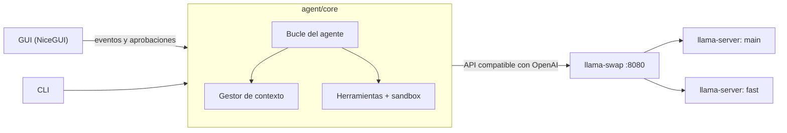
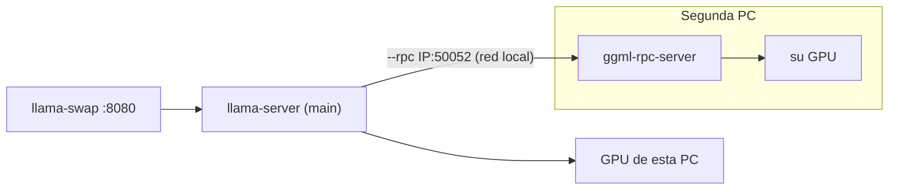

# Agente local

Un agente de programación que corre **100 % en tu PC**: lee, busca, edita y ejecuta código en tu
proyecto usando modelos de lenguaje locales. Sin API externa, sin coste por uso y sin que tu código
salga de tu máquina.

Funciona sobre [llama.cpp](https://github.com/ggml-org/llama.cpp) y
[llama-swap](https://github.com/mostlygeek/llama-swap), y trae una interfaz gráfica que te guía para
instalarlo, elegir modelos, ajustar la memoria de la GPU y trabajar con el agente.

## Características

- **Agente con herramientas**: lista, lee y busca archivos, edita con diffs precisos y ejecuta
  comandos (tests, linters, git…) en un bucle hasta terminar la tarea.
- **Seguro por defecto**: solo accede a la carpeta del proyecto, y te pide confirmación, mostrándote
  el diff o el comando exacto, antes de modificar archivos o ejecutar nada.
- **Varios modelos por rol**: `main` (el agente), `fast` (resúmenes de contexto) y `draft`
  (decodificación especulativa). Se cambian desde la GUI y llama-swap los carga y descarga solo.
- **Contexto que no se cae**: cuando la conversación se llena, compacta por escalones (omite
  resultados viejos, resume turnos antiguos, recorta mensajes enormes) y te avisa de cada paso. Si
  aun así no cabe, no llama al modelo: te explica qué ocupa el espacio y qué hacer.
- **Errores explicados**: servidor caído, falta de VRAM, respuestas cortadas o JSON inválido se
  muestran como tarjetas con la causa y cómo arreglarlo, nunca como una traza.
- **Ajuste al hardware**: una calculadora de VRAM lee la arquitectura real de cada modelo. El botón
  **Recalcular** decide qué modelo descargado va a cada rol, dónde corre cada uno (tu GPU, la RAM o
  una segunda PC) y con qué contexto y KV cache.
- **Recomendaciones al día**: **Recargar recomendaciones** busca en Hugging Face modelos nuevos para
  programar que usan herramientas de forma nativa y caben en tu hardware.
- **Varias conversaciones**: se guardan solas. Puedes retomarlas, renombrarlas, borrarlas, y
  exportarlas o importarlas como archivo.
- **Compatible con modelos MoE grandes**: los expertos que no caben en la GPU se quedan en la RAM
  sin hundir la velocidad (p. ej. un modelo de 35B en una GPU de 16 GB).

## Requisitos

| | Mínimo | Recomendado |
|---|---|---|
| Sistema | Windows 10/11 (x64) | Windows 11 |
| GPU | NVIDIA con 8 GB de VRAM | NVIDIA con 16 GB o más |
| RAM | 16 GB | 32 GB (para modelos MoE con expertos en RAM) |
| Disco | 15 GB libres | 40 GB o más (los modelos pesan de 2 a 22 GB) |
| Software | Python 3.11 o superior, driver NVIDIA actualizado | Git |

Sin GPU NVIDIA también funciona, pero en CPU será muy lento.

## Instalación

### 1. Clona el repositorio e instala Python

```powershell
git clone https://github.com/codigo-francisco/agent-local.git
cd agent-local
```

Instala Python 3.11 o superior desde [python.org](https://www.python.org/downloads/windows/). Marca
«Add python.exe to PATH» durante la instalación.

### 2. Descarga llama.cpp con CUDA

En las [releases de llama.cpp](https://github.com/ggml-org/llama.cpp/releases) descarga **dos zips
de la misma versión de CUDA** y descomprime ambos en la carpeta `bin/` del proyecto:

- `llama-bXXXXX-bin-win-cuda-13.x-x64.zip` (los programas)
- `cudart-llama-bin-win-cuda-13.x-x64.zip` (las librerías de CUDA)

> **Importante:** los dos zips deben ser de la misma versión de CUDA (ambos 12.x o ambos 13.x). Si
> los mezclas, llama.cpp no detecta la GPU y usa solo la CPU sin avisar. La página **Requisitos** de
> la app lo comprueba y te dice qué falta.

### 3. Descarga llama-swap

En las [releases de llama-swap](https://github.com/mostlygeek/llama-swap/releases) descarga
`llama-swap_XXX_windows_amd64.zip` y descomprímelo también en `bin/`.

### 4. Arranca la aplicación

```powershell
.\start.bat
```

O haz doble clic en `start.bat`. La primera vez crea un entorno virtual (`.venv`) e instala las
dependencias, lo que tarda un par de minutos.

Si la ventana nativa no se abre, usa el modo navegador:

```powershell
.\start.bat -Browser
```

### 5. Configúralo desde la GUI

1. **Requisitos**: comprueba que todo está en verde. Cada punto explica por qué hace falta y cómo
   arreglarlo.
2. **Modelos**: descarga uno o varios modelos, del catálogo o de **Recargar recomendaciones**.
3. **Configuración**: pulsa **Recalcular**. Te propone qué modelo va a cada rol (`main`, `fast`,
   `draft`), dónde corre cada uno y con qué parámetros. Revisa la propuesta y pulsa **Aplicar**.
   Elige también la carpeta del proyecto en el que vas a trabajar.
4. **Servidor**: pulsa **Arrancar**.
5. **Chat**: pídele algo, por ejemplo *«corre los tests y arregla lo que falle»*.

## Modelos recomendados

El catálogo integrado (página **Modelos**) los descarga con un clic desde Hugging Face:

| Modelo | Tamaño | Rol | Para qué |
|---|---|---|---|
| **Qwen3.6 35B-A3B** | 22 GB | main | El más capaz para GPUs de 16 GB. MoE: parte de los expertos va a la RAM. Usa herramientas de forma nativa y razona antes de actuar. |
| gpt-oss 20B (OpenAI) | 14 GB | main | Cabe entero en 16 GB. Rápido y sólido depurando. |
| Qwen3.5 9B | 6 GB | fast | Resúmenes de contexto, o agente ligero para GPUs pequeñas. |
| Qwen2.5-Coder 7B / 3B | 2-5 GB | main / fast | Para GPUs de 8 GB. |

Para un agente es clave que el modelo **use herramientas de forma nativa** (*tool calling*). Los
modelos antiguos como Qwen2.5-Coder escriben las llamadas como texto. El agente intenta rescatarlas,
pero es menos fiable.

Puedes añadir cualquier otro GGUF desde **Modelos → Descargar otro modelo**, o copiándolo a `models/`.

### Recargar recomendaciones

El catálogo es fijo. **Modelos → Recargar recomendaciones** busca modelos nuevos en la API pública de
Hugging Face, entre los repos GGUF de unsloth, bartowski, lmstudio-community y ggml-org:

- Descarta los que no llaman herramientas de forma nativa (según su plantilla de chat) y los de
  arquitecturas que tu `llama.cpp` no sabe cargar.
- Para cada modelo elige la cuantización que mejor equilibra calidad y velocidad **en tu hardware**.
  Usa tu GPU, las PCs remotas de la lista y la RAM permitida según tu
  [preferencia de cálculo](#preferencia-de-cálculo). Por defecto suma toda la VRAM como una sola.
- Te dice dónde correría cada uno («Cabe entero en tu tarjeta gráfica», «Cabe entero en la VRAM
  sumando la PC remota», «Usa toda tu tarjeta y deja ≈4 GB en la RAM del PC»…). Lo descargas con un
  clic.
- Si añades, quitas, activas o desactivas una PC remota (o la mides con «Probar»), las
  recomendaciones se recalculan al momento con la nueva VRAM total, sin volver a consultar internet.

Los resultados se guardan en `generated/recommendations.json`. Tras descargar uno, pulsa
**Recalcular** para asignarle rol y memoria.

### Qué decide Recalcular

«Recalcular» usa los modelos descargados, también los que aún no están en la configuración:

- **Roles**: `main` es el más capaz que corre bien aquí (tamaño, herramientas nativas y velocidad).
  `fast` es el pequeño que mejor combina con él. Puede quedarse vacío si no compensa: entonces `main`
  hace los resúmenes. `draft` solo se asigna si es de la misma familia y `main` no es MoE.
- **Dónde corre cada modelo**: *Esta PC* (GPU, más RAM si hace falta), *Repartido* (con la GPU de la
  PC remota) o *PC remota* (entero allí, deja tu GPU libre para el otro). Cómo pesa la PC remota
  lo decide la [preferencia de cálculo](#preferencia-de-cálculo). Por defecto, su VRAM cuenta como
  VRAM total y se usa antes que la RAM.
- **Parámetros**: contexto, KV cache, capas en GPU, «main y fast a la vez» y tokens de salida.

Mientras calcula, una ventana te va diciendo qué hace. Primero vuelve a medir la VRAM de las PCs
remotas. Nada cambia hasta que pulsas **Aplicar**.

## Cómo funciona



1. Tu petición entra en el **bucle**, que envía la conversación al modelo junto con la lista de
   herramientas.
2. El modelo responde con texto o pide una herramienta. El bucle la ejecuta dentro del workspace (tras
   tu aprobación si modifica algo) y le devuelve el resultado.
3. Se repite hasta que el modelo da la tarea por terminada o se alcanza el límite de pasos.
4. Antes de cada llamada, el **gestor de contexto** comprueba que todo cabe en la ventana del modelo
   y compacta si hace falta.

El núcleo no depende de la interfaz ni de llama.cpp: habla el protocolo de OpenAI, así que puedes
apuntarlo a Ollama o LM Studio cambiando el *endpoint* en **Configuración**.

### Herramientas del agente

| Herramienta | Qué hace | ¿Pide aprobación? |
|---|---|---|
| `list_files` | Lista archivos (ignora `.git`, `node_modules`, entornos virtuales…) | No |
| `read_file` | Lee un archivo con números de línea, por rangos si es grande | No |
| `search` | Busca una expresión regular en el proyecto | No |
| `edit_file` | Sustituye un fragmento exacto de un archivo | Sí, con diff |
| `write_file` | Crea o sobrescribe un archivo | Sí, con diff |
| `run_command` | Ejecuta un comando de PowerShell con timeout | Sí, muestra el comando |

Cada petición de aprobación ofrece cuatro opciones, **por herramienta**:

- **Aprobar**: solo esta vez.
- **Rechazar**: el agente recibe la negativa y busca otra forma.
- **Aprobar en esta sesión**: no vuelve a preguntar por esa herramienta hasta cerrar la app.
- **Aprobar siempre**: se guarda en la configuración. Puedes quitar estos permisos uno a uno, o todos
  a la vez, en **Configuración → Permisos permanentes**.

Las herramientas MCP también piden aprobación, salvo que su servidor tenga `"autoApprove": true`.

## Servidores MCP

El agente puede usar herramientas externas mediante el
[Model Context Protocol](https://modelcontextprotocol.io): bases de datos, navegadores, GitHub,
sistemas de archivos adicionales, etc. Se configuran en **Configuración → Servidores MCP**, con el
mismo formato que Claude Desktop o Cursor, así que puedes copiar la configuración de la
documentación de cada servidor:

```json
{
  "mcpServers": {
    "filesystem": {
      "command": "npx",
      "args": ["-y", "@modelcontextprotocol/server-filesystem", "D:/Documentos"]
    },
    "remoto": {
      "url": "https://ejemplo.com/mcp",
      "headers": { "Authorization": "Bearer TU_TOKEN" }
    }
  }
}
```

- `command` / `args` / `env` / `cwd`: servidor local por stdio.
- `url` / `headers`: servidor remoto por HTTP (*streamable HTTP*).
- `"autoApprove": true`: no pedir confirmación para sus herramientas (por defecto, sí se pide).
- `"disabled": true`: dejarlo configurado pero sin conectar.

Las rutas relativas de `command` (p. ej. `bin/…`) se buscan en la carpeta del proyecto.

### codebase-memory-mcp (recomendado)

[codebase-memory-mcp](https://github.com/DeusData/codebase-memory-mcp) construye un grafo de
conocimiento del código (símbolos, llamadas, arquitectura) y ofrece 17 herramientas para consultarlo.
El agente encuentra código sin leer archivos enteros, lo que ahorra mucho contexto. Es un binario
único, 100 % local.

1. Descarga `codebase-memory-mcp-windows-amd64.zip` de sus
   [releases](https://github.com/DeusData/codebase-memory-mcp/releases) y descomprímelo en
   `bin/codebase-memory-mcp/`. No hace falta ejecutar su `install.ps1`.
2. Añádelo en **Configuración → Servidores MCP**:
   ```json
   { "mcpServers": { "codebase-memory": { "command": "bin/codebase-memory-mcp/codebase-memory-mcp.exe" } } }
   ```
3. Pídele al agente que indexe el proyecto («indexa este repositorio con codebase-memory»). Guarda el
   índice en `~/.cache/codebase-memory-mcp`.

Las herramientas aparecen al modelo como `mcp__<servidor>__<herramienta>`. La configuración se guarda
en `config/mcp.json`, que no se versiona porque puede contener tokens (hay un ejemplo en
`config/mcp.example.json`). Pulsa **Guardar y reconectar** tras cada cambio. En el CLI, los servidores
se conectan al arrancar.

## Configuración

Todo se ajusta desde la GUI y se guarda en `config/models.yaml`. Lo principal:

| Ajuste | Qué controla |
|---|---|
| Carpeta del proyecto | Dónde trabaja el agente. Se aplica al momento y empieza una conversación nueva. |
| Contexto | Cuántos tokens ve el modelo a la vez. Más contexto = más VRAM. |
| KV cache | `f16` (máxima precisión), `q8_0` (la mitad de memoria, recomendado) o `q4_0`. |
| Capas en GPU | `99` = todo en la GPU; `-1` = automático (llama.cpp reparte GPU/RAM, ideal para MoE). |
| Main y fast a la vez | Mantener ambos modelos cargados (más rápido) o que se turnen (menos VRAM). |
| Tokens de salida | Máximo por respuesta. Los modelos que razonan necesitan más (16K). |
| Endpoint | Servidor compatible con OpenAI (llama-swap por defecto; también Ollama, LM Studio…). |

`generated/llama-swap.yaml` se genera automáticamente a partir de esta configuración: no lo edites a
mano.

## Usar una segunda PC

Si un modelo no cabe en tu GPU, puedes sumar la GPU de otra PC de tu red. Usa el backend RPC de
llama.cpp: en la otra PC corre `ggml-rpc-server` y el `llama-server` de esta la usa como una GPU más,
repartiendo las capas entre las dos. La otra PC **no necesita** Python, la app ni los modelos: los pesos
viajan por la red.



**En esta PC**

1. **Configuración → PCs remotas → Generar paquete para la otra PC**. Crea `generated/rpc-worker.zip`
   (≈0,6 GB) con `ggml-rpc-server.exe` y las DLL de **tu misma versión** de llama.cpp. Las dos PCs
   tienen que usar la misma versión: si actualizas llama.cpp, vuelve a generar el paquete.
2. Después de preparar la otra PC, pulsa **Añadir PC**, escribe su IP y pulsa **Probar**: se mide su
   VRAM y la calculadora la tiene en cuenta.
3. Pulsa **Recalcular** para que decida dónde va cada modelo, o elígelo tú en **Dónde corre**
   (*Esta PC*, *Repartido con PC remota* o *PC remota*). Después pulsa **Guardar** y reinicia el
   servidor.

**En la segunda PC** (Windows con GPU NVIDIA)

1. Actualiza el driver de NVIDIA.
2. Copia el zip, descomprímelo (por ejemplo en `C:\agent-rpc`) y marca la red como **Privada**.
3. Ejecuta `permitir-firewall.bat` **como administrador** (solo una vez). Abre el puerto 50052
   solo para la IP de la PC principal.
4. Abre `start-worker.bat` y deja la ventana abierta mientras uses el agente.
5. Busca su IP con `ipconfig` («Dirección IPv4»). Te conviene reservarla en el router para que no
   cambie.

### Preferencia de cálculo

En **Configuración → Preferencia de cálculo** eliges cómo reparten la memoria «Recalcular» y las
recomendaciones. El cambio se guarda al momento; pulsa «Recalcular» para aplicarlo a tus modelos.

| Preferencia | Qué hace |
|---|---|
| **Preferir lo local primero** | Tu tarjeta gráfica y, si no cabe, la RAM de esta PC. Las PCs remotas solo si el modelo no cabe aquí ni con la RAM. |
| **Preferir la VRAM total** (por defecto) | Suma la VRAM de las PCs remotas a la tuya como si fuera una sola tarjeta, y la usa antes que la RAM, aunque la red sea algo más lenta. |
| **Optimizar la velocidad** | Lo que haga responder más rápido al modelo principal, con medidas reales. Por ejemplo, un MoE va más rápido con parte en la RAM (64 tok/s) que repartido por la red (52 tok/s); un modelo denso, al revés. |

En todos los casos, entre dos opciones iguales se prefiere la local. **Al añadir, quitar, activar o
desactivar una PC** (o medirla con «Probar»), la VRAM total y los cálculos cambian al momento. La
lista se guarda con «Guardar».

> **Seguridad:** el protocolo RPC de llama.cpp no tiene contraseña ni cifrado. Úsalo solo en tu red de
> casa y no abras el puerto en el router.

- **Red**: mejor con cable Gigabit. La primera carga de un modelo manda sus pesos por la red
  (unos 3 minutos por cada 20 GB). Las siguientes usan la caché de la otra PC (`-c`) y son mucho
  más rápidas.
- **Estado**: la página **Servidor** muestra si cada PC remota responde, y **Diagnóstico** la comprueba.
- **«Probar» se queda esperando** con el servidor en marcha: la otra PC atiende a un solo cliente a la
  vez. Para el servidor y vuelve a probar.

## Uso desde la terminal

Con el servidor en marcha (arráncalo desde la GUI):

```powershell
.venv\Scripts\python -m agent.cli -w D:\ruta\a\tu\proyecto
```

| Opción | Descripción |
|---|---|
| `-w`, `--workspace` | Carpeta del proyecto (por defecto, la de la configuración) |
| `-m`, `--model` | Rol o nombre del modelo (`main`, `fast`, …) |
| `--auto` | No pedir confirmación antes de editar o ejecutar |

Dentro del CLI, `/nuevo` empieza otra conversación, `/deshacer` revierte los archivos que cambió el
último turno y `/salir` termina. `--workspace` y `--auto` solo valen para esa ejecución: nunca se
guardan en la configuración.

## Red de seguridad

- **Deshacer**: tras cada turno que cambia archivos aparece «Deshacer». Restaura los originales
  (también después de reiniciar la app) y no pisa archivos que hayas editado después. Los comandos
  ejecutados no se deshacen.
- **Conversaciones guardadas (multichat)**: cada conversación se guarda sola tras cada turno, aunque
  la app se cierre de golpe, y empezar una nueva nunca borra las anteriores. En la columna izquierda
  del chat están **todas**, agrupadas por carpeta de proyecto (la actual primero). Haz clic para
  retomar una: si es de otra carpeta, el agente cambia a esa carpeta. Usa el buscador para
  encontrarla. Con **⋮** puedes
  **Renombrar**, **Exportar…** (un `.json` donde elijas) o **Eliminar**. **Importar** (icono de
  subir) carga una exportada, también desde otra PC, en la carpeta actual. Están en
  `generated/sessions/`.
- **Codificación**: los archivos en cp1252/latin-1 o con BOM se editan conservando su codificación.
- **«Detener»** corta al momento un comando en curso o un modelo que se está cargando; un servidor
  que se cuelga a mitad de respuesta se detecta a los 180 s.
- **Registro**: `generated/logs/agent.log` (botón «Abrir carpeta de logs» en «Servidor»).
- **Diagnóstico**: la página «Diagnóstico» revisa binarios, modelos, VRAM, servidor y MCP, y exporta
  un .zip (sin tokens ni variables de entorno de MCP) para pedir ayuda.
- **Modo seguro**: `agent-gui --safe` arranca sin MCP, sin modo automático y sin permisos «siempre».
- Si `config/models.yaml` está dañado, la app arranca con valores por defecto y guarda el archivo roto
  como `models.yaml.bak-<fecha>`.

## Desarrollo

```powershell
.venv\Scripts\python -m pytest                        # rápidos (~2-3 s): lo del día a día
.venv\Scripts\python -m pytest tests\test_loop.py -x  # un archivo, parando en el primer fallo
.venv\Scripts\python -m pytest --lf                   # solo los que fallaron la última vez
.venv\Scripts\python -m pytest -m "slow or not slow"  # todo, incluidos los que abren procesos
.venv\Scripts\python -m ruff check agent tests
```

Los tests marcados `slow` arrancan PowerShell o servidores MCP reales; el CI los ejecuta siempre.
`tests/chaos_server.py` simula un servidor que se cuelga, corta la conexión o se queda sin memoria.

## Solución de problemas

**«La ejecución de scripts está deshabilitada en este sistema»**
Windows bloquea los `.ps1` por defecto. Usa `start.bat`: ejecuta el script con permiso solo para ese
proceso, sin cambiar la configuración del sistema.

**El modelo no se carga en la GPU o va muy lento**
Mira la página **Requisitos**: debe decir «GPU detectada». Si no, casi siempre es que los zips de
llama.cpp y de cudart son de versiones de CUDA distintas. Descarga de la misma release el `cudart` que
coincida con tu `llama-…-cuda-XX`.

**«No cabe en la memoria de la GPU» / out of memory**
Pulsa **Recalcular** en Configuración, o baja el contexto, usa KV `q8_0`, o desactiva «Main y fast a
la vez». La calculadora de VRAM muestra cuánto ocupa cada cosa.

**El agente describe lo que va a hacer pero no lo hace**
El modelo no usa bien las herramientas. Cambia a uno con *tool calling* nativo (Qwen3.6, gpt-oss,
Qwen3.5).

**«El puerto 8080 ya está en uso»**
Hay otro llama-swap o servidor abierto. Ciérralo o cambia el puerto en Configuración.

**«PC remota … no responde»**
En la otra PC, comprueba que `start-worker.bat` sigue abierto, que la IP no ha cambiado (`ipconfig`),
que la red es Privada y que ejecutaste `permitir-firewall.bat` como administrador. Si dice que falta
`MSVCP140.dll`, instala el Visual C++ Redistributable:
`winget install Microsoft.VCRedist.2015+.x64`.

**«Tiene otra versión de llama.cpp»**
Actualizaste llama.cpp en esta PC. Genera de nuevo el paquete y reemplaza la carpeta de la otra PC.

**El contexto se llena en tareas largas**
Es normal: el agente compacta solo y te avisa. Si llega al límite, te explica qué ocupa el espacio.
Empieza una conversación nueva (lo hecho en disco se conserva) o pide leer archivos por rangos.

## Desarrollo

### Estructura

```
agent/
  core/      bucle, herramientas, cliente LLM, gestión de contexto (sin dependencias de interfaz)
  server/    requisitos, calculadora de VRAM, Recalcular, llama-swap.yaml, gestor del servidor, descargas
  gui/       páginas de la interfaz (NiceGUI)
  cli.py     interfaz de terminal
config/
  catalog.yaml   catálogo de modelos recomendados (versionado)
  models.yaml    tu configuración local (no se versiona)
tests/       pruebas automáticas
bin/ models/ generated/   binarios, modelos y archivos generados (no se versionan)
```

### Tests

```powershell
.venv\Scripts\python -m pytest
```

No necesitan GPU, modelos ni red. El bucle del agente se prueba con un modelo simulado, incluidos
los casos de fallo: desbordamiento de contexto, respuestas cortadas, servidor caído, JSON inválido y
llamadas escritas como texto.

### Qué no se versiona

`.gitignore` deja fuera todo lo que se descarga o depende de cada máquina. En un clon nuevo:

- `bin/` y `models/`: se descargan siguiendo la [instalación](#instalación) y desde la página Modelos.
- `.venv/`: lo crea `start.bat`.
- `config/models.yaml`: se crea con valores por defecto al arrancar. Asigna tus modelos y pulsa
  **Recalcular**.
- `generated/`: se regenera al guardar la configuración.

## Licencia

Este proyecto aún no tiene licencia. Mientras no se añada una, se aplican los derechos de autor por
defecto.
